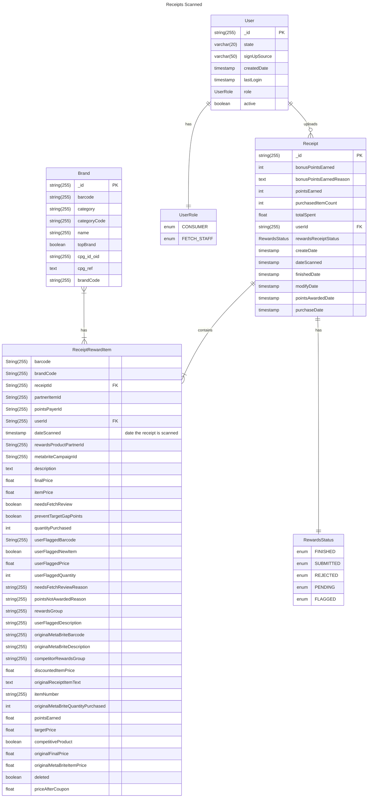

# fetch-assignment

### 1. ER Diagram

```mermaid
---
title: Receipts Scanned
---
erDiagram
    User ||--o{ Receipt : uploads
    User ||--|| UserRole: has
    Receipt ||--|{ ReceiptRewardItem : contains
    Receipt ||--|| RewardsStatus: has
    Brand }|--|{ ReceiptRewardItem : has

    User {
        string(255) _id PK
        varchar(20) state
        varchar(50) signUpSource
        timestamp createdDate
        timestamp lastLogin
        UserRole role
        boolean active
    }

    Receipt {
        string(255) _id PK
        int bonusPointsEarned
        text bonusPointsEarnedReason
        int pointsEarned
        int purchasedItemCount
        float totalSpent
        string(255)  userId FK
        RewardsStatus rewardsReceiptStatus
        timestamp createDate
        timestamp dateScanned
        timestamp finishedDate
        timestamp modifyDate
        timestamp pointsAwardedDate
        timestamp purchaseDate
    }

    RewardsStatus {
        enum FINISHED
        enum SUBMITTED
        enum REJECTED
        enum PENDING
        enum FLAGGED
    }

    UserRole {
        enum CONSUMER
        enum FETCH_STAFF
    }

    Brand {
        string(255) _id PK
        string(255) barcode
        string(255) category
        string(255) categoryCode
        string(255) name
        boolean topBrand
        string(255) cpg_id_oid
        text cpg_ref
        string(255) brandCode
    }

    ReceiptRewardItem {
        String(255) barcode
        String(255) brandCode
        String(255) receiptId FK
        String(255) partnerItemId
        String(255) pointsPayerId
        String(255) userId FK
        timestamp   dateScanned "date the receipt is scanned"
        String(255) rewardsProductPartnerId
        String(255) metabriteCampaignId
        text description
        float finalPrice
        float itemPrice
        boolean needsFetchReview
        boolean preventTargetGapPoints
        int quantityPurchased
        String(255) userFlaggedBarcode
        boolean userFlaggedNewItem
        float userFlaggedPrice
        int userFlaggedQuantity
        string(255) needsFetchReviewReason
        string(255) pointsNotAwardedReason
        string(255) rewardsGroup
        string(255) userFlaggedDescription
        string(255) originalMetaBriteBarcode
        string(255) originalMetaBriteDescription
        string(255) competitorRewardsGroup
        float discountedItemPrice
        text originalReceiptItemText
        string(255) itemNumber
        int originalMetaBriteQuantityPurchased
        float pointsEarned
        float targetPrice
        boolean competitiveProduct
        float originalFinalPrice
        float originalMetaBriteItemPrice
        boolean deleted
        float priceAfterCoupon
    }
```

### 2. All codes and descriptions used to answer part 1 - part 4 are stored in `analysis.ipynb`

